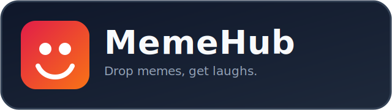

<p align="center">
  
</p>

<h1 align="center">MemeHub</h1>

<p align="center">
  Platform berbagi meme berbasis Laravel dengan Google Login, upload media, report system, dan panel moderasi admin.
</p>

---

## ✨ Fitur Utama

- Google OAuth login (tanpa registrasi manual/password)
- Upload meme (gambar/video) + tags
- Upvote, komentar, bookmark, follow user
- Report postingan meme (untuk user login)
- Contact/report form internal dengan upload screenshot
- Admin moderasi laporan konten
- Dukungan multi-bahasa (Indonesia / English)

## 🧱 Tech Stack

- Laravel 10
- Blade + Tailwind CSS + Alpine.js
- MySQL / MariaDB
- Laravel Socialite (Google OAuth)

## 🚀 Quick Start (Local)

1) Clone repository

```bash
git clone https://github.com/Pashinoh/memehub.git
cd memehub
```

2) Install dependency

```bash
composer install
npm install
```

3) Setup environment

```bash
cp .env.example .env
php artisan key:generate
```

4) Sesuaikan `.env`

- `APP_URL`
- `DB_*`
- `GOOGLE_CLIENT_ID`
- `GOOGLE_CLIENT_SECRET`
- `GOOGLE_REDIRECT_URI` (default: `${APP_URL}/auth/google/callback`)
- `ADMIN_EMAILS` (contoh: `ADMIN_EMAILS=admin@gmail.com`)

5) Migrasi + build asset

```bash
php artisan migrate
npm run build
```

6) Jalankan aplikasi

```bash
php artisan serve
```

## 🔐 Google OAuth Setup

Tambahkan Authorized redirect URI di Google Cloud Console:

```text
https://your-domain.com/auth/google/callback
```

Contoh production saat ini:

```text
https://shinz.my.id/auth/google/callback
```

## 🌍 Deployment Notes

- Gunakan `APP_ENV=production` dan `APP_DEBUG=false`
- Pastikan folder `storage` dan `bootstrap/cache` writable
- Jalankan:

```bash
php artisan optimize:clear
php artisan config:cache
php artisan route:cache
php artisan view:cache
```

- Buat symlink storage:

```bash
php artisan storage:link
```

## 📁 Struktur Penting

- `app/Http/Controllers/Auth/GoogleAuthController.php` → login Google
- `app/Http/Controllers/ReportController.php` → report meme
- `app/Http/Controllers/Admin/ReportModerationController.php` → moderasi admin
- `app/Http/Controllers/ContactController.php` → contact/report form + screenshot
- `resources/views/memes/index.blade.php` → feed utama & upload modal
- `resources/views/admin/reports/index.blade.php` → UI moderasi

## 📄 License

Project ini menggunakan lisensi [MIT](LICENSE).
