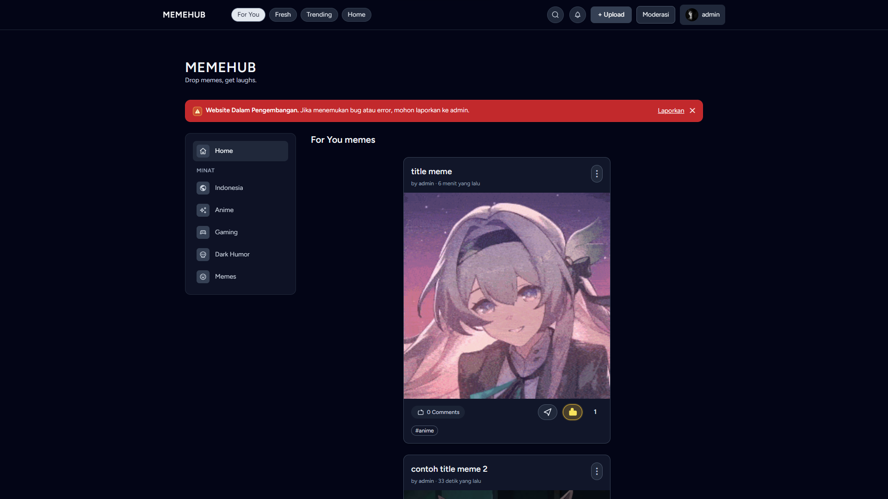
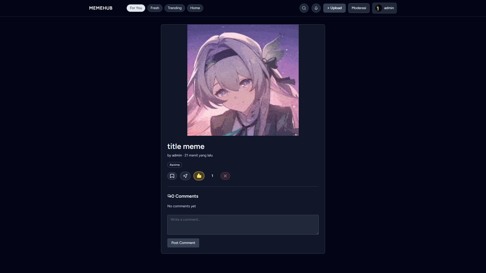
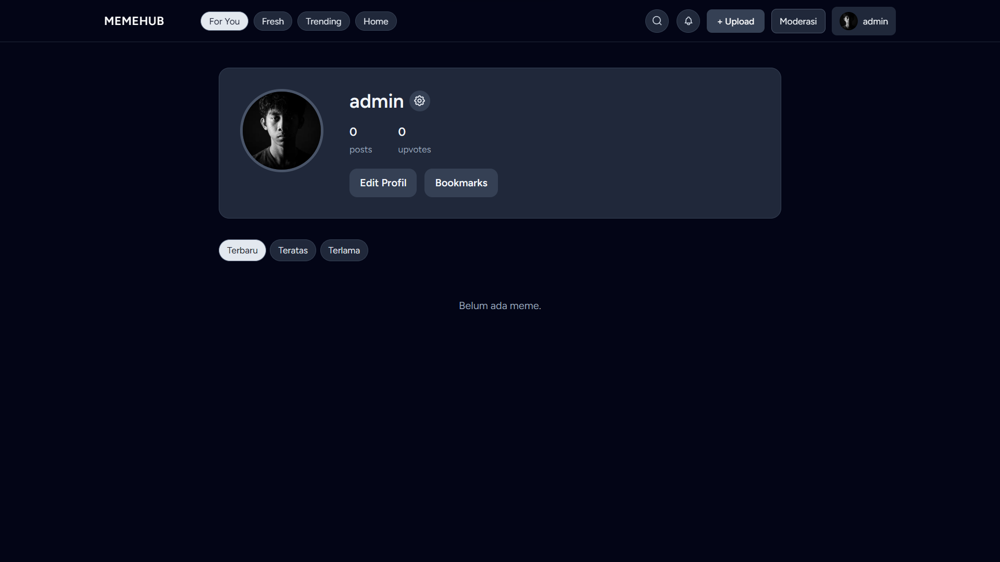
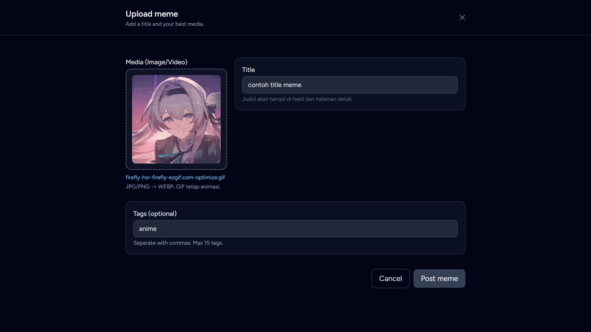

<p align="center">
	
</p>

# MemeHub

A Laravel-based meme-sharing platform with Google Login, media uploads, reporting workflow, and admin moderation.

Current version: `v1.3.6`

## Quick Start (No Redis Needed)

1. **Install dependencies**:
   ```bash
   composer install
   npm install && npm run build
   ```
2. **Setup environment**:
   Copy `.env.example` to `.env` and configure your database (`DB_*`).
3. **Run migrations & seeders**:
   ```bash
   php artisan migrate
   ```
4. **Run development server**:
   ```bash
   php artisan serve
   ```

## Key Optimizations
- **No Redis Dependency**: Default drivers are configured to use `file` and `database` for instant deployment.
- **Media Compression**: Uploaded images are automatically converted to optimized WebP, and GIFs are resized and compressed to reduce server bandwidth usage.
- **Database Indexed**: Search and feeds are optimized with indexes on `score` and `created_at`.

## Screenshots

| Feed / Home | Detail Meme |
| :---: | :---: |
|  |  |
| **Login Page** | **Upload Modal** |
|  |  |

## License

This project is licensed under the [MIT License](LICENSE).
